# Open Trickler Assembly Manual

## BOM

| **Name**                                  | **Quantity** | **Remarks** |
|:-----------------------------------------:|:------------:|:-----------:|
| Heatset Inserts M3x5x4                    | 24           |             |
| M3x6 BHCS                                 | 7            |             |
| M3x8 BHCS                                 | 9            |             |
| M3x12 SHCS                                | 4            |             |
| M3x10 SHCS                                | 8            |             |
| M3x8 SHCS                                 | 7            |             |
| 6804-2RS  Bearing                         | 2            |             |
| 608-2RS Bearing                           | 2            |             |
| Nema 17 34mm Stepper Motor                | 2            |             |
| Shim Washer (OD=6mm, ID=3mm, Thick=0.5mm) | 10           |             |

## Tools

Subject to the self supplied components, following tools may be required. 

* 2.0mm, 2.5mm ball-end hex drivers are recommended.

## Assemble Open Trickler Rear Body

### Overview

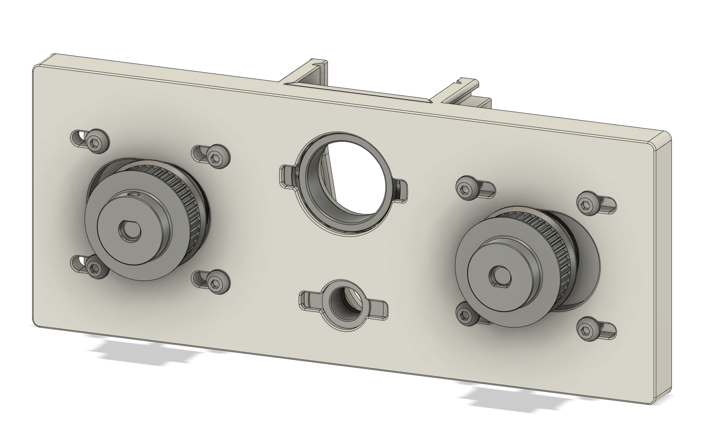

### Component Prep

This design relies heavily on heatset inserts. Make sure you have the proper inserts (check the hardware
reference for a close up picture and the BOM for dimensions).

Melt 4x heatset inserts to the bottom part of the rear body with your soldering iron. Make sure 
heatset inserts are flush with the bottom surface. 

### Assembly

Press 6804-2RS bearing to the top cut out and 608-2RS to the bottom cut out. [Printable bearing insert helpers](../STL/OpenTrickler/Tools) are supplied if you want to use bench top vise in this application. 

Slide the bearing cover to the rear cut out. The cover should sit flush with the top of the rear body, while two bearings are still free to rotate without resistance.

If you can feel the abnormal resistance after installing the bearing cover, press the bearings inwards for additional 0.1mm to clear the interference. 

Use 8x M3x8 BHCS screws with the optional equal number of M3 shim washers to fix two stepper motors onto the rear body, but don't tighten them yet. Make sure the motor can slide left to right. 

Slide 2x 40T pulley to the motor shaft but don't tighten the set screws yet. The pulley height will be adjusted in the later step.

Slide the rear door to the cut out and the rear body assembly is complete. 

## Assemble Open Trickler Front Body

### Overview

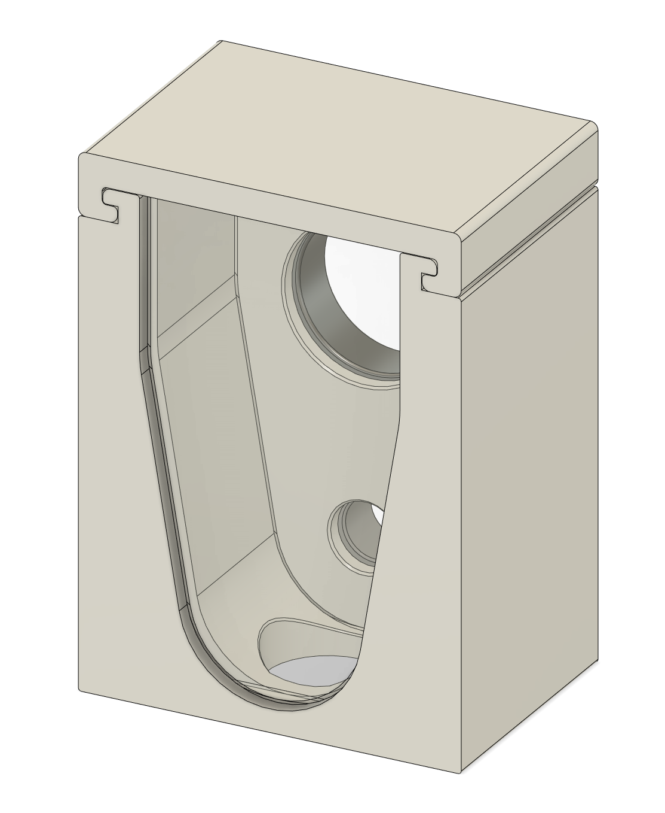

### Component Prep

Flop the printed part over and melt 4x heatset inserts to the bottom part of the front body with your soldering iron. 
Make sure heatset inserts are flush with the bottom surface

### Assembly

Press 6804-2RS bearing to the top cut out and 608-2RS to the bottom cut out. [Printable bearing insert helpers](../STL/OpenTrickler/Tools) are supplied if you want to use bench top vise in this application.

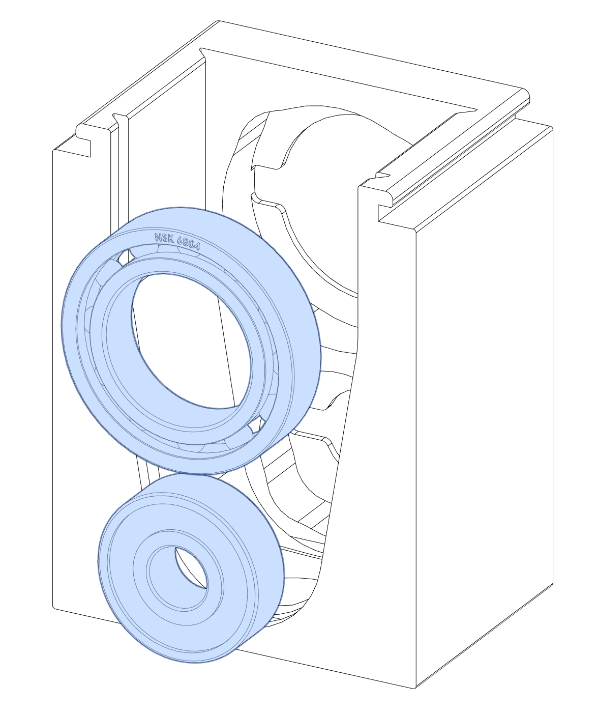

Slide the bearing cover to the rear cut out. The cover should sit flush with the top of the rear body, while two bearings are still free to rotate without resistance.

If you can feel the abnormal resistance after installing the bearing cover, press the bearings inwards for additional 0.1mm to clear the interference.

Slide the front door to the cut out, the front door should sit flush with the top of the front body

Slide the front body cover to the groove top of the front body then the front body assembly is complete.

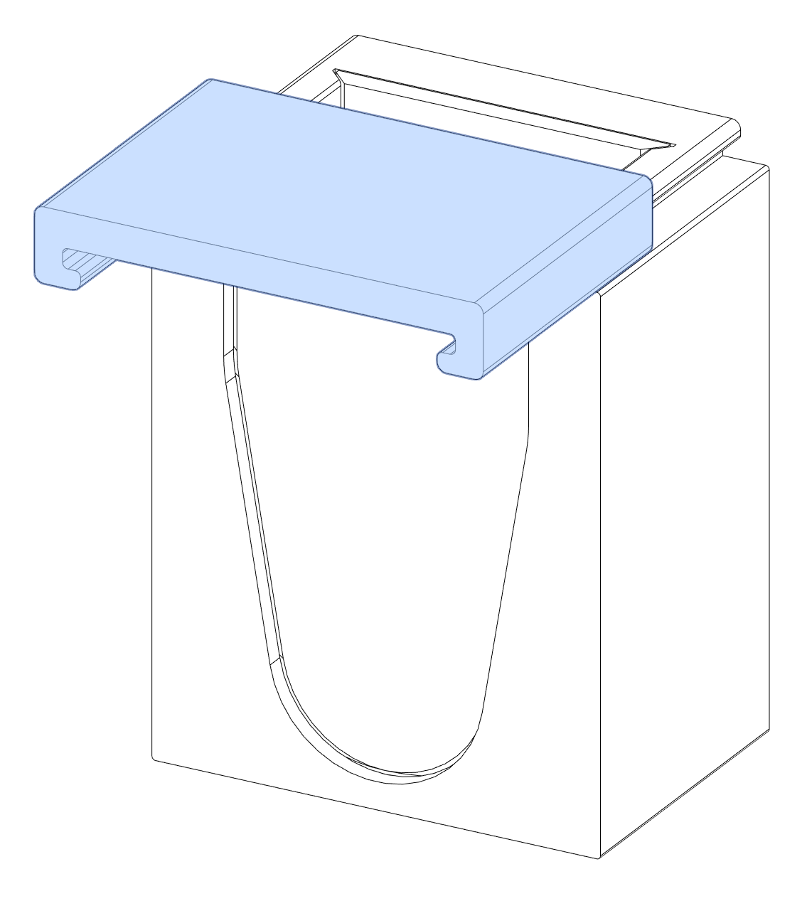

## Assemble Open Trickler Body

### Overview

### Assembly

Insert both large and small rotary tube through the rear bearing. You may experience some resistance subject to the 
tolerance of the printed part. 

Slide the motor towards rotary tubes to the nearest position. Once done, slide the belt onto rotary tubes and pulleys. Make
sure the longer belt is connected to the motor on the right side. **Do not tension the belt, nor adjust the depth of the pulley for now.**

Side rotary tubes to the front body though bearings. 

The OpenTrickler is now partially assembled. In the later steps the OpenTrickler will be mounted to one of the scale adapter for final assembly.

## Assemble A&D FX-120i/300i Weight Pan

Skip this step if you're using scales other than A&D FX-120i/300i. 

### Overview

### Inspection

Insert the scale to weight pan adapter to the square groove of the A&D FX-120i/300i scale bottom down, make sure the adapter can be inserted to be groove and seat firmly. If not, you may need to check the printing parameters to achieve the firm fit. 

### Component Prep

Melt 1x heatset insert into the bottom side of the cup base. Make sure the heatset insert seats flush with the bottom surface.

Melt 1x heatset insert into to the scale to weight pan adapter. Make sure the heatset insert seats flush with the top surface.

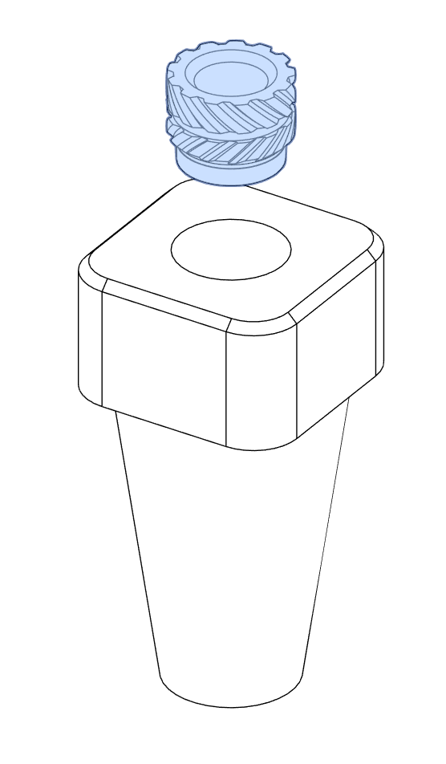

### Assembly

Use 1x M3x6 BHCS to join the weight pan with the scale to weight pan adapter. 

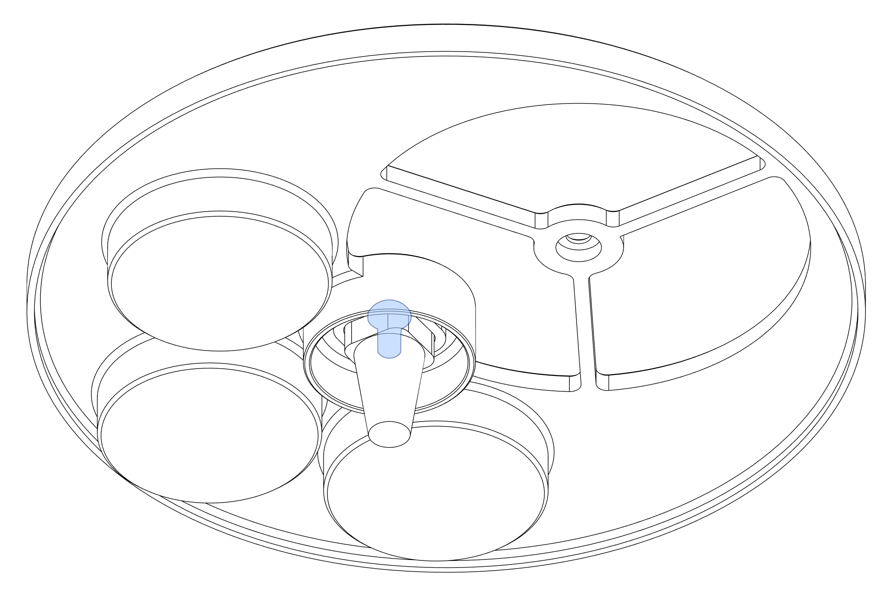

Then use 1x M3x6 BHCS to join the cup base to the weight pan. 

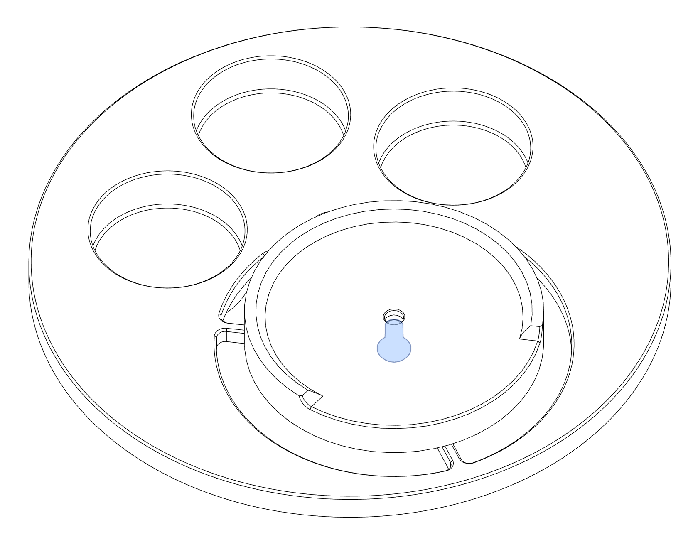

### Put some money in the pocket

You need to provide some coins in all 3 pockets to increase the overall weight of the weight pan to reach the minimum weight of A&D FX-120i/300i. The stock weight pan is measured at 100 gram. Coins are needed to add up to this weight. 

What coin to use? Below is the reference table. 

| Coin            | Diameter | Weight | Minimum Quantity |
| --------------- | -------- | ------ | ---------------- |
| New Zealand \$2 | 26.5 mm  | 10 g   | 6                |
| Australia $1    | 25 mm    | 9 g    | 7                |
| Euro €2         | 25.75 mm | 8.5 g  | 7                |
| US $1           | 26.49 mm | 8.1 g  | 8                |

## Assemble A&D FX Shield

Skip this step if you're using scales other than A&D FX-120i/300i.

### Overview

The FX Shield provides the interface between the A&D FX-120i/300i.The Open Trickler is also designed to
be mounted directly on top. 

### Component Prep

8x heatset inserts are to be melted into the plastic on both sides of the scale shield printed part. 

### Lower Assembly

Use 4x M3x12 SHCS to join scale base adapter ring, scale pan cover and scale shield together. 

### Upper Assembly

Use 8x M3x10 SHCS to join the trickler adapter plate, with front and rear discharger. Screws are to be
threaded to the bottom the Open Trickler front and rear body. 

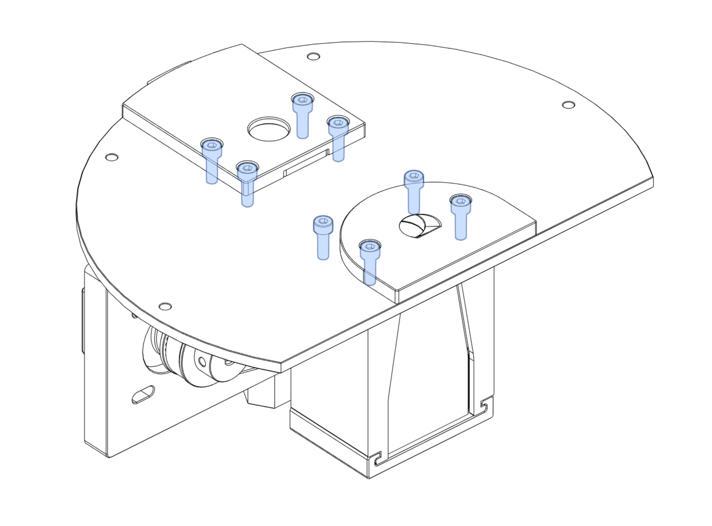

### Put upper and lower together

Use 4x M3x8 SHCS to join the upper and lower together. (The Open Trickler body is hidden to for demonstration purpose)

## Assemble Pan Cover

The pan cover is used to protect the pan from dust or accidental drops. The pan cover can be seamly
put onto the shield body when not used. 

Skip this step if you're using scales other than A&D FX-120i/300i.

### Overview

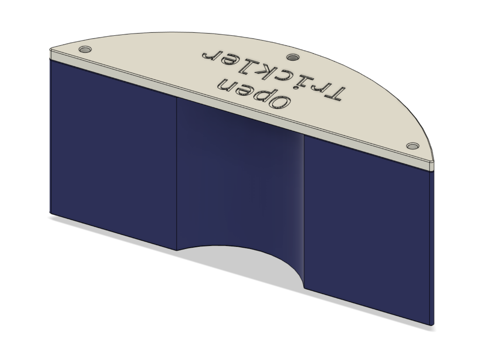

### Component Prep

Melt 3x heatset inserts into the plastic body from the top.

Install 2x M3x6 BHCS to the bottom of the lower body. Please do not over tighten those screws
as they are designed to directly screw into the plastic. 

### Assembly

Use 3x M3x8 SHCS to join the pan cover lid to the body. 

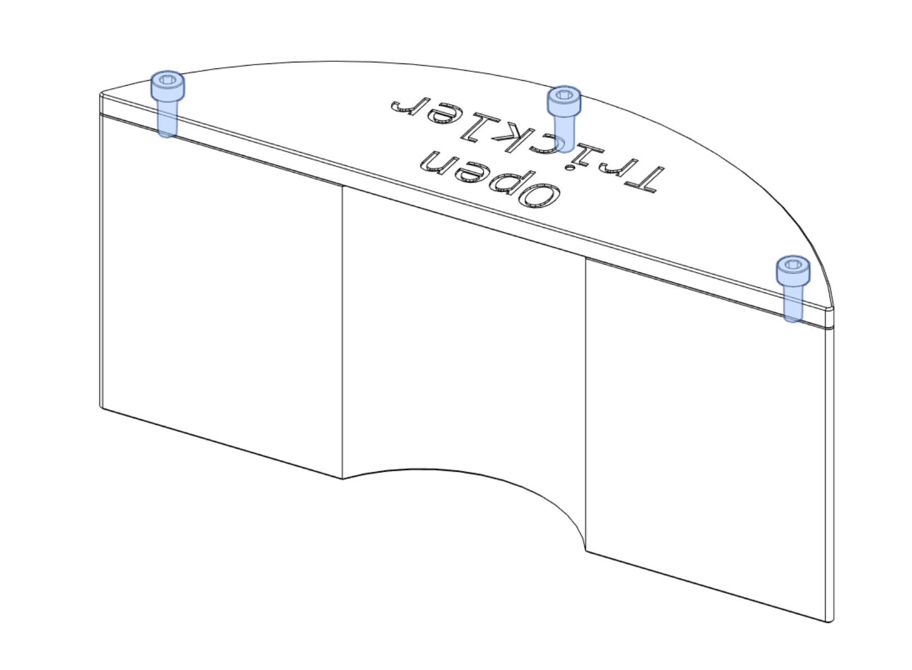

## Assemble Rear Discharge Cup

The discharge cup is used to help cleaning powder from the reservoir by catching remaining powder
from the drainage hole. 

### Overview

### Component Prep

Melt 2x heatset inserts into the ring. 

### Assembly

Use 2x M3x6 BHCS to join the ring to the discharge cup. 

## Powder Hopper Assembly

### Overview

### Assembly

Stack the hopper base to the rear body interface. Note the travel limiter should sit in the groove and the valve is in the "open" position. 

Stack 2x M3 washer to the rear body adapter pocket, then thread the M3x8 BHCS directly to the hopper base. Don't over tighten the screw and make sure the hopper base can rotate (with some resistance) between ON and OFF position. 

Lastly, slide the powder hopper to the top of the rear body. Make sure to push the powder hopper all the way in. The rear body adapter should sit flush with the rear body assembly.

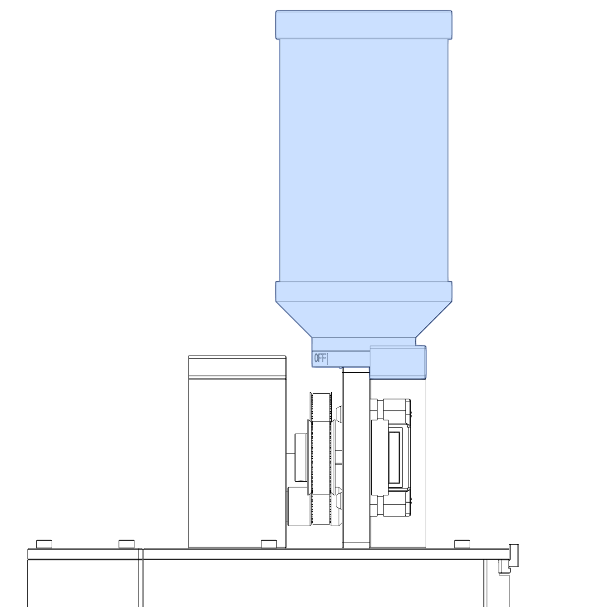

## Post Installation Adjustments

### Adjust Pulley Depth

Look through the unit from the left and right side, push or pull the pulley on the shaft to align the flange with the rotary tubes.

### Tension The Belt

You need to adjust the tension of the belt. First loosen 8x M3x8 BHCS used to secure stepper motors. 
Then pull motors slightly to tension the belts. Once done, tighten all 8 screws. 

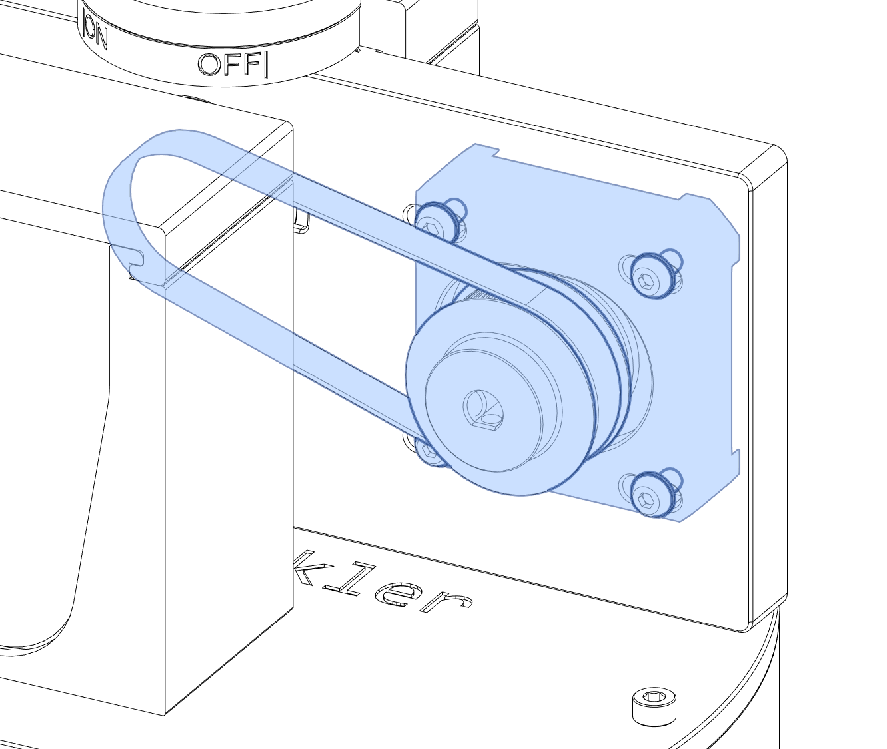

# Congratulations

Your Open Trickler v1.2 is now assembled!

