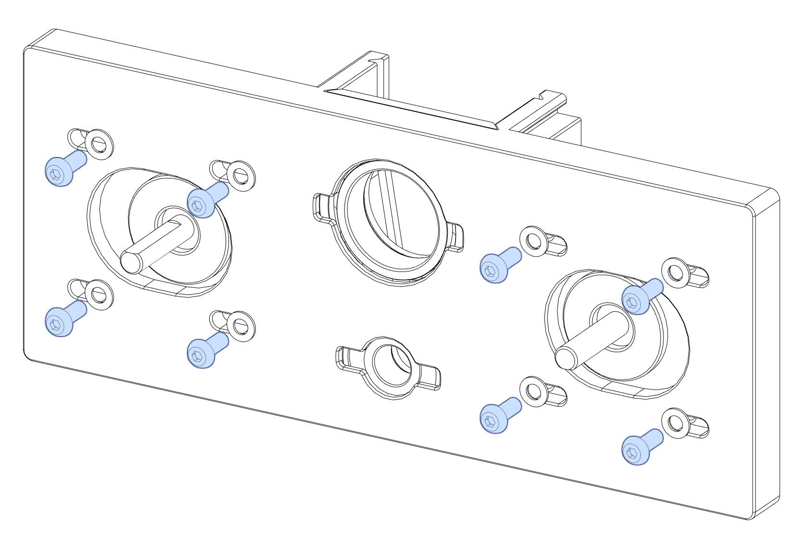
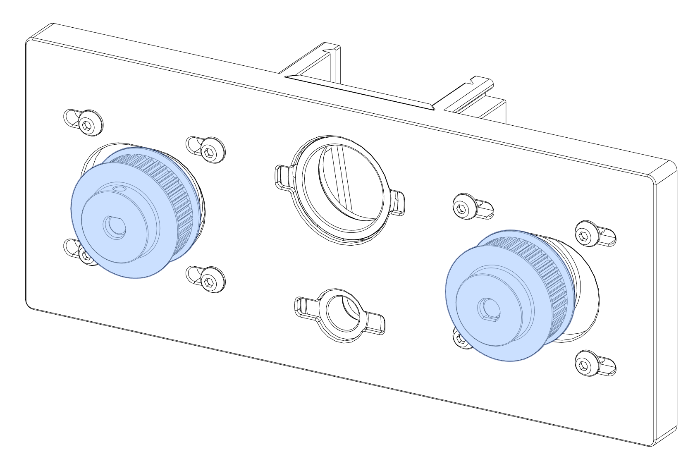
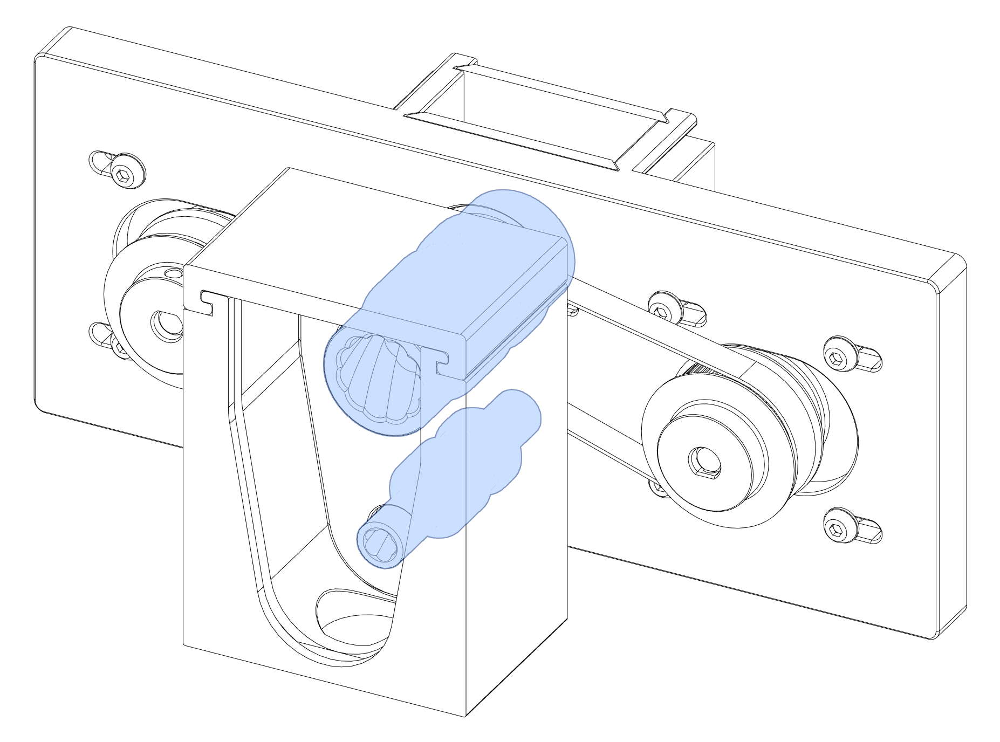
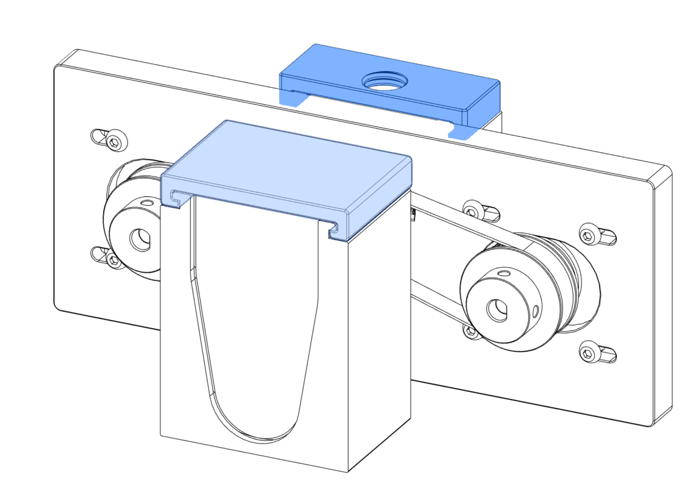
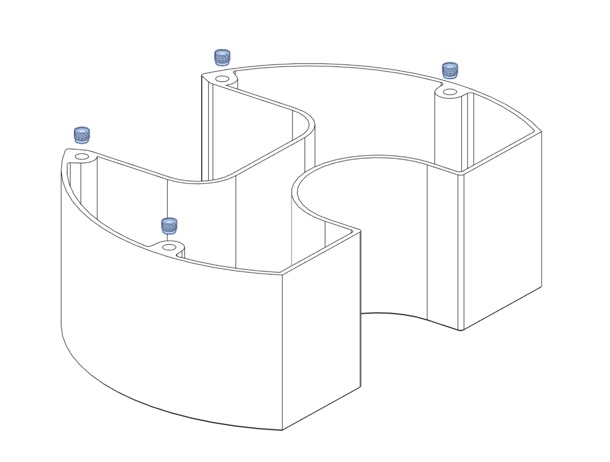
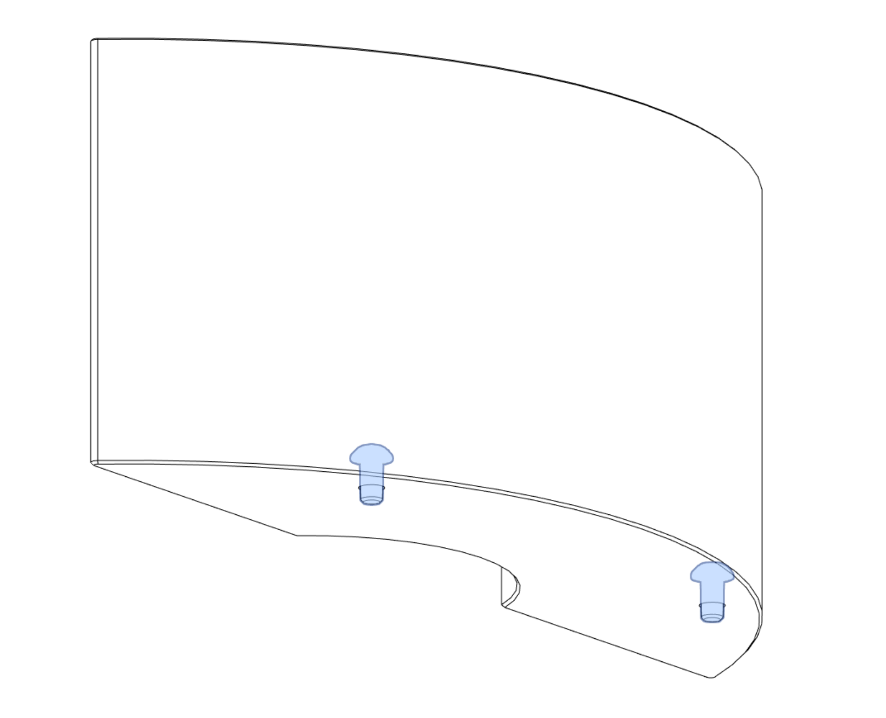
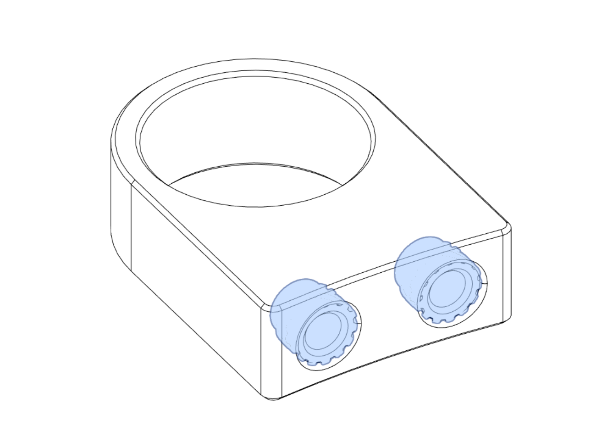
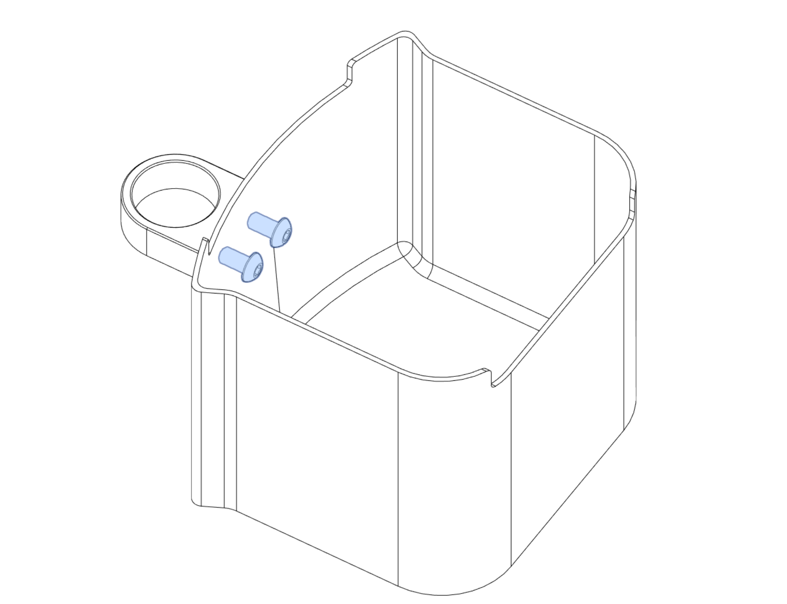
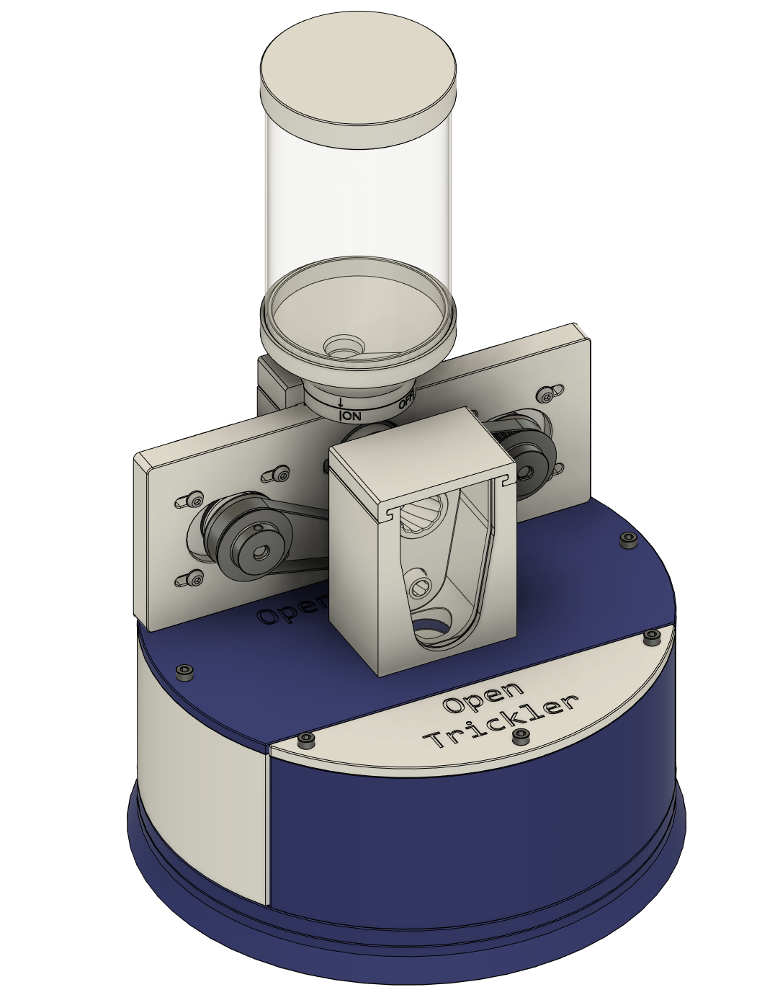

# Open Trickler Assembly Manual

## BOM
|          **Name**          | **Quantity** | **Remarks** |
|:--------------------------:|:------------:|:-----------:|
|   Heatset Inserts M3x5x4   |      22      |             |
|          M3x6 BHCS         |       5      |             |
|          M3x8 BHCS         |       8      |             |
|         M3x12 SHCS         |       4      |             |
|         M3x10 SHCS         |       8      |             |
|          M3x8 SHCS         |       7      |             |
|      6804-2RS  Bearing     |       2      |             |
|       608-2RS Bearing      |       2      |             |
| Nema 17 20mm Stepper Motor |       2      |             |

## Tools
Subject to the self supplied components, following tools may be required. 
* 2.0mm, 2.5mm ball-end hex drivers are recommended.

## Assemble Open Trickler Rear Body
### Overview

### Component Prep
This design relies heavily on heatset inserts. Make sure you have the proper inserts (check the hardware
reference for a close up picture and the BOM for dimensions).

Melt 4x heatset inserts to the bottom part of the rear body with your soldering iron. Make sure 
heatset inserts are flush with the bottom surface. 

### Assembly
Press 6804-2RS bearing top the top cut out and 608-2RS to the bottom cut out. You may experience some 
resistance but that is normal. 

Use 8x M3x8 BHCS screws to fix two stepper motors onto the frame, but don't tighten them yet.
Make sure the motor can slide left to right. 

Install 2x 40T pulley to the motor shaft. The pulley height will be adjusted in later steps. 

## Assemble Open Trickler Front Body
### Overview

### Component Prep
Flop the printed part over and melt 4x heatset inserts to the bottom part of the front body with your soldering iron. 
Make sure heatset inserts are flush with the bottom surface

### Assembly
Press 6804-2RS bearing top the top cut out and 608-2RS to the bottom cut out. You may experience some 
resistance but that is normal. 

## Assemble Open Trickler Body
### Overview

### Assembly
Insert both large and small rotary tube through the rear bearing. You may experience some resistance subject to the 
tolerance of the printed part. 

Adjust the motor position towards rotary tubes. Once done, slide the belt onto rotary tubes and pulleys. Make
sure the longer belt is connected to the motor on the right side. 

Side rotary tubes to the front body though bearings. 

The last step is to slide the front, rear doors to the groove, then side front and rear cover to the top of front and 
rear groove. 

## Assemble A&D FX-120i/300i Weight Pan Adapter
### Overview

### Component Prep

### Assembly
Use 1x M3x6 BHCS to install the top part to the weight pan adapter. The screw should sit flush or 
below, more importantly, not extruding beyond the surface.

## Assemble A&D FX Shield
### Overview
The FX Shield provides the interface between the A&D FX-120i/300i.The Open Trickler is also designed to
be mounted directly on top. 

### Component Prep
8x heatset inserts are to be melted into the plastic on both sides of the scale shield printed part. 

### Lower Assembly
Use 4x M3x12 SHCS to join scale base adapter ring, scale pan cover and scale shield together. 

### Upper Assembly
Use 8x M3x10 SHCS to join the trickler adapter plate, with front and rear discharger. Screws are to be
threaded to the bottom the Open Trickler front and rear body. 

### Put upper and lower together
Use 4x M3x8 SHCS to join the upper and lower together. (The Open Trickler body is hidden to for demonstration purpose)

## Assemble Pan Cover
The pan cover is used to protect the pan from dust or accidental drops. The pan cover can be seamly
put onto the shield body when not used. 

### Overview

### Component Prep
Melt 3x heatset inserts into the plastic body from the top.

Install 2x M3x6 BHCS to the bottom of the lower body. Please do not over tighten those screws
as they are designed to directly screw into the plastic. 

### Assembly
Use 3x M3x8 SHCS to join the pan cover lid to the body. 

## Assemble Rear Discharge Cup
The discharge cup is used to help cleaning powder from the reservoir by catching remaining powder
from the drainage hole. 

### Overview

### Component Prep
Melt 2x heatset inserts into the ring. 

### Assembly
Use 2x M3x6 BHCS to join the ring to the discharge cup. 

## Post Installation Adjustments
You need to adjust the tension of the belt. First loosen 8x M3x8 BHCS used to secure stepper motors. 
Then pull motors slightly to tension the belts. Once done, tighten all 8 screws. 

# Congratulations
Your Open Trickler is assembled!

