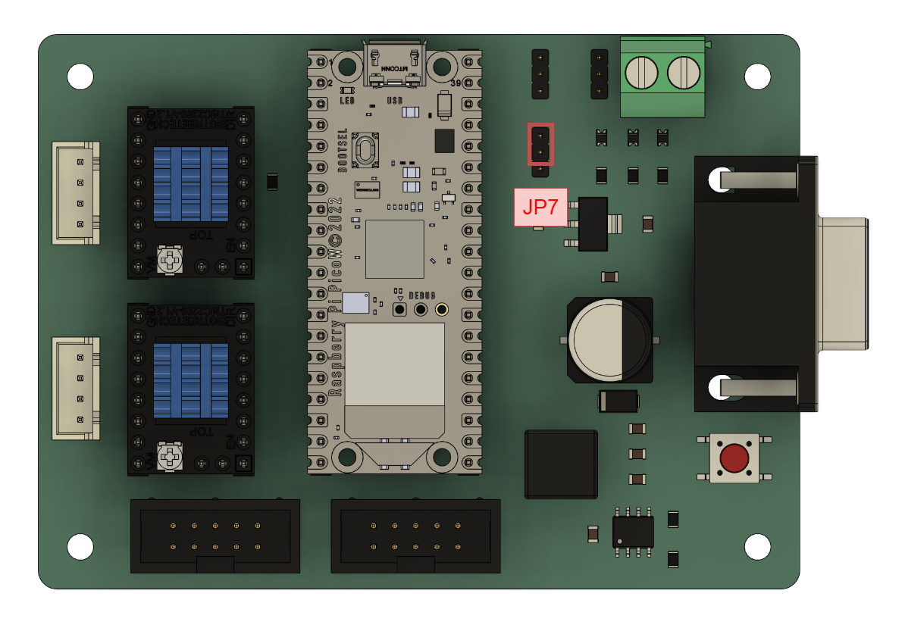
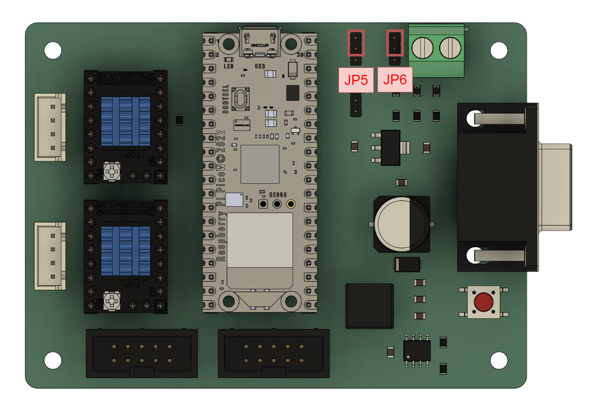
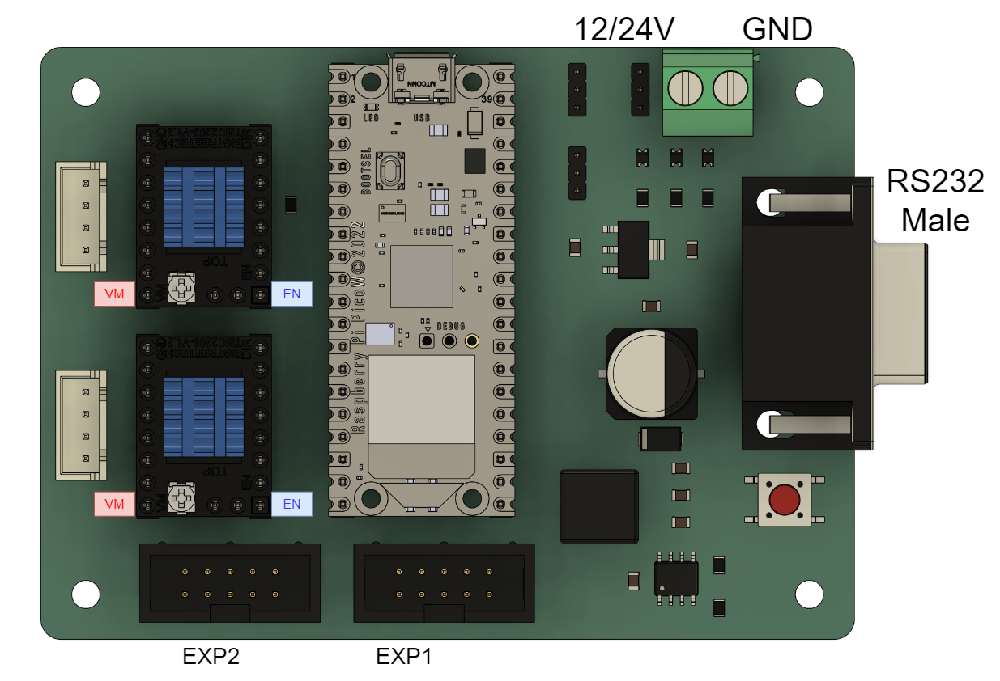
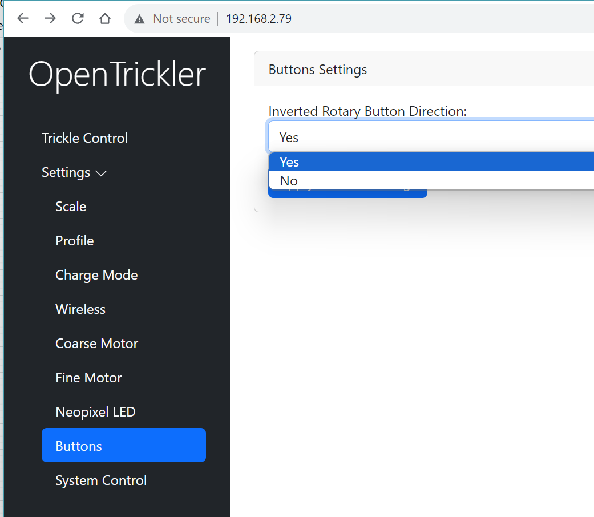
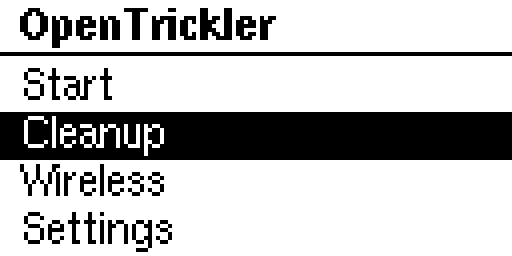
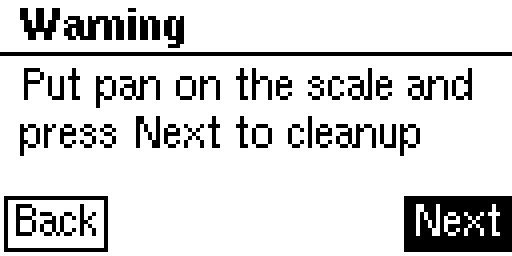
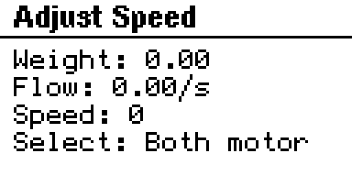
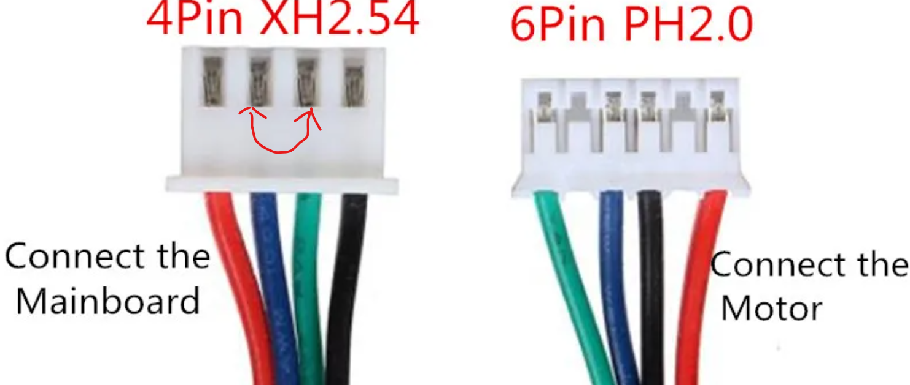
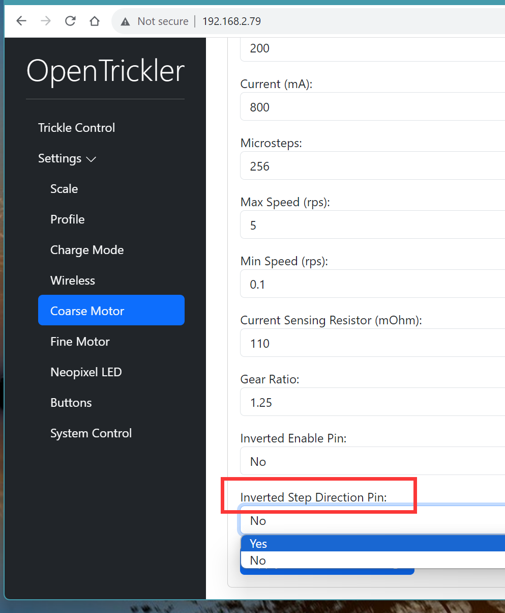

# OpenTrickler Initialization Guide

## Pre-requisite

Below are pre-requisite steps you need to follow before continue.

1. [OpenTrickler assembly](assembly.md)

2. [Firmware deployment](https://github.com/eamars/OpenTrickler-RP2040-Controller/blob/main/manuals/firmware_update_via_usb.md)

3. Make sure you have everything prepared from [Sourcing Guide](sourcing_guide.md)

## Jumpers

At this step you will need 3x 2mm pitch Jumper Cap. 

### 3.3v Power Select

You can select the 3.3v source from either the Pico W or the on-board regulator.  In most cases it is recommended to use the *on-board voltage regulator* to supply the 3.3v rail. 

**(Recommended) Use Jumper Cap to connect the bottom 2 pins of JP7 to use on-board 3.3V regulator**

**Use Jumper Cap to connect the top 2 pins of JP7 to use Pico W 3.3V regulator**

### RS232 Cable Type Select

To match the type of RS232 cable (with DB9 header), you need to select between the straight through wiring and null modem wiring. 

[*What is NULL modem and straight through?*](https://www.decisivetactics.com/support/view?article=crossover-or-null-modem-vs-straight-through-serial-cable)

**Use Jumper Cap to connect top 2 pins of JP5 and JP6 to match with straight through cable**

**Use Jumper Cap to connect bottom 2 pins of JP5 and JP6 to match with NULL modem cable**

## Install Plug-in Components

### Install Raspberry Pico W

If your Raspberry Pico W doesn't come with headers pre-soldered, you will need to solder 2x 20 pin headers (2.54mm pitch) to the Pico W, then insert to the socket. Make sure the mini USB port is pointing towards the edge of the board. 

*Tips: Insert the 2x 20 pin header to the socket first, then solder pins to the Pico W will save your effort to line everything up.*

### Install Stepper Motor Driver

Stepper motor drivers need to be inserted with specific orientation. Failed to do so will result in permanent damage to the board and the stepper motor driver. Make sure both VM and EN are lined up with the footprint from the board. 

## Wiring

It is time to wire everything up. Before turning on the power, double check the connection and placement of components. 

**Notes**

- If you happen to use the Fysetc mini 12864 display, you may need to flip both EXP1 and EXP2 upside down (notch to the opposite side) due to the mirrored PIN out.
- There is no standard colour code, or the PIN order for the stepper motor cable. We will get into the stepper motor wiring and diagnose later.
- Pay special attention to the placement of power supply cable, Pico W and stepper motor drivers. Incorrect installation of those components may result in permanent damage to those components.

## Initial Startup Checks

It is time to power the board up! You may proceed if there is no visible [magic smoke](https://en.wikipedia.org/wiki/Magic_smoke).

### Inspect LED

There are 3x LEDs on the board and one on the Pico W. See the definition from the diagram below. You're supposed to see all power related LEDs (5V, 3.3V, DCIN) turned on. The green LED (WiFi indication) on the Pico W is suppose to blink at 1Hz/s (If you already have the firmware loaded. Otherwise see the pre-requisite section above). 

### Inspect Screen

You should be able to see the OpenTrickler menu from the screen, with back lights turned on. The two RGB LEDs underneath the rotary button is also supposed to emit white light. 

Troubleshooting

* If the screen shows blank but there is backlight, you may need to press the RESET button on the board and check again. 
* If the screen shows blank and no backlight, you may need to check the EXP1 and EXP2 wiring. 
* If you have any doubt, join our discord and ask for help. 

### Connect to WiFi

You will need to follow [Connect to Wireless](https://github.com/eamars/OpenTrickler-RP2040-Controller/blob/main/manuals/connect_to_wireless.md) procedure to connect the Pico W to your home wireless and gain the access to the advanced configuration manual from the web interface. 

### Inspect Rotary Buttons

Subject to the vender of mini 12864 display, the rotary button direction can be interpreted in opposite direction. The designed direction is, when you rotate the nub clockwise, the menu cursor is suppose to move downwards. 

If the cursor moves in the opposite direction, you can correct it by login to the web interface, select "Buttons" and set "Yes" of the "Inverted Rotary Button Direction" option. 

You will need to save the settings to the EEPROM and reboot. 

### Inspect Motors

A quick way to validate the function of motors is to use Cleanup mode. 

*The cleanup mode is designed to clear the remaining powder left in the tube.*

**Steps:**

1. From the main menu, rotate the button until the cursor points to the "Cleanup", press the button downwards to continue.
   

2. You will then see the warning page. Make sure there is no powder in the reservoir, then rotate the button to "Next", press the button downwards to continue.  
   

3. You will then see the "Adjust Speed" menu. 
   
   At "Adjust Speed" menu, rotate the button clockwise or counter clockwise to adjust the speed of both motors. Use RESET button to exit. Pressing the button downwards will change the control of motors. 

**Validations:**

* If any of, or both motor vibrates, instead of moving clockwise or counter clockwise, you need to swap the middle two pins of the motor cable. 
  
* For positive speed, the both motors should rotate clockwise. If not, then you need to invert the motor step direction via the web interface, by toggling "Inverted Step Direction Pin, under "Coarse Motor", or/and "Fine Motor". You will need to save the settings to the EEPROM and reboot. 
  

### Configure and Inspect Scale Communication

* If you're using A&D fx120i/300i series scale, follow the [guide by OE5AMP](https://github.com/eamars/OpenTrickler-RP2040-Controller/blob/main/manuals/OpenTrickler%20manual%20for%20ADFX%20scale.pdf) to configure the scale to report automatically. 
  - If your scale was previously configured for AutoTrickler v3/v4, you will only need to follow Step 2 to update the data output mode. 
* If you're using other scales, sorry, at the time this manual is written, the setup procedure for generic scale support is absent. 

Again, the "Cleanup Mode" can be used to validate the scale communication. 

**Steps:**

1. Follow steps from **Inspect Motors** to enter the "Cleanup Mode".
2. Inspect the value after "Weight". 

**Validations"**

* If you read "inf" after the Weight, it indicates the communication to the scale is not established. Please review the connection to the scale, as well as scale settings. 
* If you can read "0" after the Weight, but the value doesn't change despite the value from the scale's screen updated. Please review the scale settings. 
