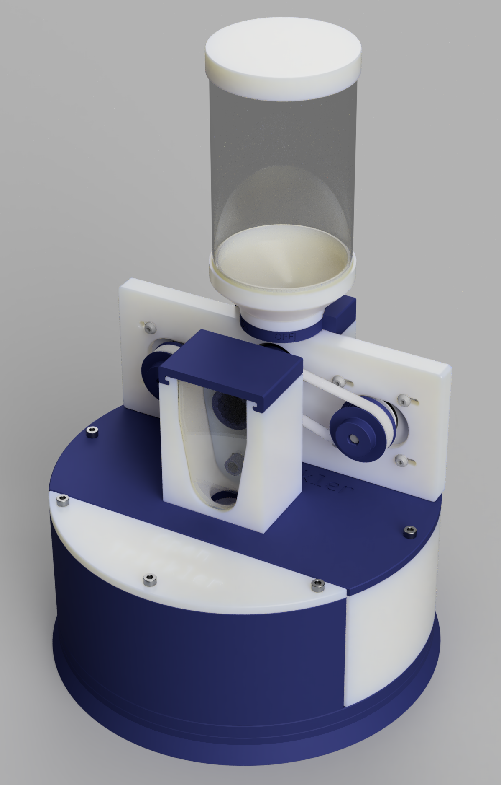

Open Trickler Mechanical Design
===========

Inspired by the [AutoTrickler v4](https://autotrickler.com/pages/autotrickler-v4) and [Super Trickler](https://supertrickler.com.au/), the OpenTrickler is designed be printed and assembled using common tools to build Voron printers.

Join our [discord server](https://discord.gg/ZhdThA2vrW) for help and development information. 

BOM
---------
BOM is now a part of the assembly [Manual](Manual/assembly.md#bom)

Print Guide
---------
The printer need to be tuned at least for extruder e-stepts and flow as it has plastic to metal contact which requires certain tolerances. The Open Trickler can be printed in various materials.

 * Body Material: ABS/PETG/PLA you name it.
 * Belt: TPU 95A.
 * 4 walls, 5 tops and bottoms.
 * 0.2mm layer height, force 0.4mm line width and 0.2mm for the first layer.
 * 40% infill is recommended.

Print Orientation 
---------
You should print provided STL with default orientation

Assembly 
---------
[Assembly Manual](Manual/assembly.md) 

Controller
--------
The Open Trickler Controller is split into following projects: 

 * Custom PCB with Raspberry Pi Pico [Raspberry Pi Pico Motor Expansion Board](https://github.com/eamars/RaspberryPi-Pico-Motor-Expansion-Board)
 * Firmware that utilises the Raspberry Pi RP2040 micro controller [OpenTrickler RP2040 Controller](https://github.com/eamars/OpenTrickler-RP2040-Controller)
